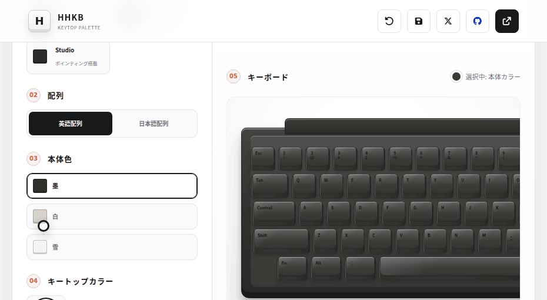

# HHKB Keytop Palette

HHKBのキートップ配色を、ブラウザ上で気軽に試せるシミュレーターです。

「Escだけ差し色にしたらどう見える？」「雪モデルに桜キーを合わせると派手すぎる？」「日本語配列だと配色のバランスは変わる？」といった迷いを、実物を買う前に画面上でさっと確認できます。



## すぐ使う

インストールは不要です。以下のURLにアクセスするだけで使えます。

https://yoshihideshirai.github.io/hhkb-keytop-palette/

## 主な機能

- HHKBのモデル・本体色を選んで、実機に近い雰囲気で配色を確認
- 英語配列 / 日本語配列を切り替えて、キーごとの見え方を比較
- パレットカラーやカスタムカラーを選び、クリック / タップでキー単位に着色
- アクセント、グラデーション、役割別の色分けなどをプリセットからワンタップ適用
- 作ったデザインをブラウザに自動保存
- URLで配色を共有できるので、購入前の相談や比較がしやすい
- スマートフォン / PCのどちらでも操作しやすいレスポンシブUI

## こんなときに便利

- HHKBのカラーキートップを買う前に、配色の完成イメージを見たい
- 何色を何個買えばよいか、だいたいの方向性を決めたい
- 英語配列と日本語配列で、差し色の置き方を比べたい
- 自分の配色案をURLで共有して、ほかの人に見てもらいたい

## ローカルで確認

開発環境で動かす場合は、以下を実行してください。

```sh
npm install
npm run dev
```

表示されたローカルURLをブラウザで開いてください。

## GitHub Pagesへの公開

`main` ブランチへpushすると、GitHub Actionsが `npm ci` と `npm run build` を実行し、生成された `dist` をGitHub Pagesへデプロイします。初回のみリポジトリの **Settings → Pages → Build and deployment → Source** を **GitHub Actions** に設定してください。

このプロジェクトは環境変数を必要としないため、GitHub Pagesのプロジェクトサイト（サブパス）でもそのまま動作します。
